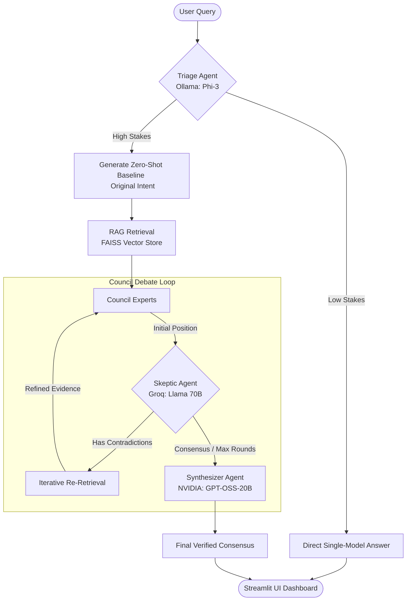

# 🏛️ Council Mode: Multi-Agent Debate & Reasoning System

[](https://www.python.org/)
[](https://streamlit.io/)
[](https://www.docker.com/)
[](https://build.nvidia.com/)
[](https://ollama.com/)

> **"Reasoning through debate, not just token prediction."**

Council Mode is a state-of-the-art **Multi-Agent Debate (MAD) System** combined with a **Multi-Hop RAG** pipeline. It is designed to aggressively mitigate LLM hallucinations and sycophancy on high-stakes factual queries through iterative verification, adversarial critique, and consensus synthesis.

---

## 🚀 Key Architectural Innovations

### 1. Hybrid Triage & Routing
- **Low-Stakes Queries**: Routed instantly to a local, zero-cost Small Language Model (**Ollama: Phi-3**) to conserve API quota and ensure sub-second response times.
- **High-Stakes Queries**: Dispatched to the full Multi-Agent Council for structured debate and grounding.

### 2. Multi-Agent adversarial Council Loop
- **Expert 1 (The Analyst)**: Driven by **DeepSeek V4 Flash** (configured with optimized medium-effort reasoning).
- **Expert 2 (The Researcher)**: Powered by **NVIDIA Qwen 122B** for deep knowledge retrieval.
- **Expert 3 (The Specialist)**: Powered by **GPT-4o-Mini** (via OpenRouter) for targeted accuracy.
- **The Skeptic (The Adversary)**: Utilizes **Groq: Llama 3.3 70B** to identify contradictions, unsupported claims, and request iterative database re-retrieval.
- **Consensus Synthesizer**: Powered by **NVIDIA: GPT-OSS-20B** to resolve expert differences and generate a highly validated final answer.

### 3. Original Intent Comparison (Baseline vs Council)
The UI presents the **Zero-Shot Baseline (Original Intent)** side-by-side with the final consensus. This shows precisely what a standard single-agent LLM would have guessed from training data versus how the RAG-grounded Council corrected the response.

---

## 🗺️ Multi-Agent Architecture



---

## 🛠️ Setup & Installation

### Prerequisites
- Install [Ollama](https://ollama.com/) (and pull Phi-3):
  ```bash
  ollama pull phi3
  ```
- [Docker](https://www.docker.com/) (optional, for containerized run).
- Python 3.12+

### 1. Local Development Setup

1. **Clone and Navigate**:
   ```bash
   git clone <your-repo-url>
   cd Gen-AI
   ```

2. **Activate Virtual Environment**:
   ```bash
   python3 -m venv venv
   source venv/bin/activate
   ```

3. **Install Dependencies**:
   ```bash
   pip install -r requirements.txt
   ```

4. **Environment Variables**:
   Create a `.env` file in the root directory:
   ```env
   # API Keys
   NVIDIA_API_KEY=your_nvidia_api_key
   GROQ_API_KEY=your_groq_api_key
   OPENROUTER_API_KEY=your_openrouter_api_key
   
   # Agent Configuration
   TRIAGE_MODEL=ollama:phi3
   EXPERT_MODEL_1=nvidia:deepseek-ai/deepseek-v4-flash
   EXPERT_MODEL_2=nvidia:qwen/qwen3.5-122b-a10b
   EXPERT_MODEL_3=openrouter:openai/gpt-4o-mini
   SKEPTIC_MODEL=groq:llama-3.3-70b-versatile
   SYNTHESIZER_MODEL=nvidia:openai/gpt-oss-20b
   
   NUM_EXPERTS=3
   MAX_DEBATE_ROUNDS=3
   CONSENSUS_THRESHOLD=0.7
   ```

5. **Run the Streamlit Dashboard**:
   ```bash
   streamlit run app.py
   ```

---

## 🐳 Docker Deployment (Production Ready)

The system is fully containerized and configured to communicate seamlessly with your local host's Ollama instance.

1. **Build and Start Container**:
   ```bash
   docker-compose up --build
   ```
2. **Access Dashboard**: Open `http://localhost:8501` in your browser.

---

## 📊 Comparative Analysis & Evaluation
The application includes a built-in **Benchmark Tab** where you can run evaluations against standard hallucination datasets (e.g., `HaluEval`, `HotpotQA`). Performance metrics (F1 Score, Latency, and Hallucination Reduction) are visualized using elegant **Plotly gauges and charts**.

---

## 📚 Rubric & Academic Justification
- **Model Implementation & Innovation**: Implemented a state-of-the-art Multi-Agent Debate architecture.
- **Model Evaluation**: Real-time side-by-side comparative analysis with Plotly gauges.
- **Modern Standards**: Fully containerized using Docker Compose.
- **Prompt Engineering**: Documented persona-based agent design and adversarial templates in `PROMPTS.md`.
